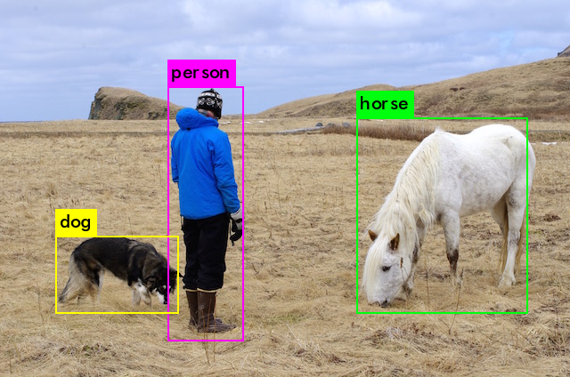

## Akka Http wrapper for the YOLO algorithm

Invoking the YOLO executable, no concurrency yet.

### Docker file
The darknet code compiles fine on my Macbook, 
but a fix (adding an import statement) is needed for the linux alpine 
distribution.

    #FROM alpine:3.4
    FROM innoq/docker-alpine-java8
    
    RUN apk add --update --no-cache \
            bash \
            build-base curl \
            make \
            gcc \
            git
    
    RUN git clone https://github.com/pjreddie/darknet.git && echo "#include <sys/select.h>\n"|cat - ./darknet/examples/go.c > /tmp/out && mv /tmp/out ./darknet/examples/go.c
    RUN (cd /darknet && make && rm -rf scripts src results obj .git \
        && curl -O https://pjreddie.com/media/files/yolo.weights)
    
    ENV SBT_VERSION=0.13.8
    RUN apk add --no-cache --virtual=build-dependencies curl && \
        curl -sL "http://dl.bintray.com/sbt/native-packages/sbt/$SBT_VERSION/sbt-$SBT_VERSION.tgz" | gunzip | tar -x -C /usr/local && \
        ln -s /usr/local/sbt/bin/sbt /usr/local/bin/sbt && \
        chmod 0755 /usr/local/bin/sbt && \
        apk del build-dependencies
    
    RUN git clone https://github.com/logicalguess/yolo-akka
    WORKDIR "yolo-akka"
    CMD sbt run

### Build and run the container
    docker build -t yolo-akka:latest .
    docker run --rm -it -p 9000:9000 yolo-akka:latest

### Test in the browser
    http://localhost:9000/test

### Use your own image
    curl --form "image=@person.jpg" http://localhost:9000/predict > result.png

### Run container in Kubernetes
    kubectl create -f kubernetes/yolo-akka-pod.yml
    kubectl expose pod yolo-akka --port=9000 --name=frontend
    kubectl port-forward yolo-akka 9000
    kubectl attach yolo-akka -i
    
### Run service in Kubernetes
    kubectl create -f kubernetes/yolo-akka-service.yml
    kubectl describe service yolo-akka-service
    kubectl run -i --tty busybox --image=busybox --restart=Never -- sh
    
    minikube service yolo-akka-service --url